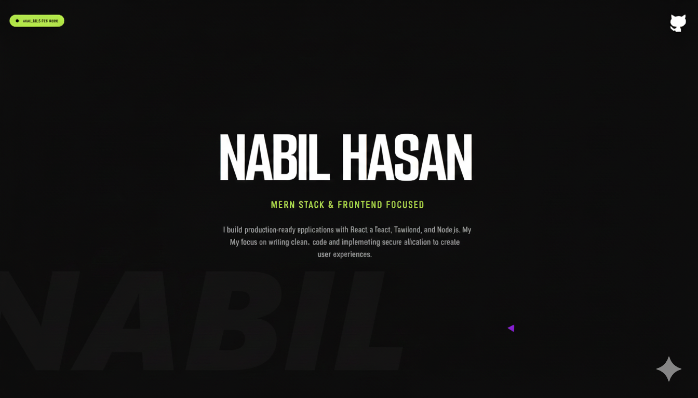

<!-- Banner Image -->

# Hi there! 👋 I'm Nabil Hasan Sopno
### Frontend Developer | Web Enthusiast

---

### About Me
I am a passionate frontend developer who loves creating responsive and interactive web applications.  
I enjoy turning designs into high-quality code and continuously learning new web technologies.  
I focus on clean UI, accessibility, and improving user experiences.

---

### 🚀 Current Activities
- Exploring **Next.js** and advanced React features  
- Building a **tourism website** project  
- Contributing to **open-source frontend projects**

---

### 🛠 Skills
**Frontend:**  


**Backend / Tools:**  


---

### 📫 Connect with Me
[](https://github.com/itsSopno)  
[](https://www.linkedin.com/in/nabilhasansopno)  
[](https://twitter.com/itsSopno)

---

### 📊 GitHub Stats


---


### :bar_chart: Coding Activity (last month)
```txt
Rust               34 hrs  🟩🟩🟩🟩🟩🟩🟩⬜⬜⬜⬜⬜⬜⬜⬜   27%
JavaScript         20 hrs  🟩🟩🟩🟩⬜⬜⬜⬜⬜⬜⬜⬜⬜⬜⬜⬜⬜   15%
