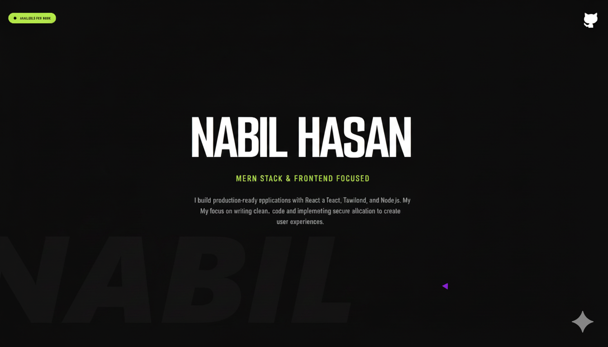

  

  # 🚀 Nabil Hasan Sopno
  ### **Frontend Engineer | MERN Stack Developer**
  
  
  

---

### 🖋️ Professional Overview
I am a **Frontend Developer** dedicated to bridging the gap between high-end design and scalable architecture. I specialize in the **MERN Stack**, with a core focus on crafting **cinematic user experiences** through fluid animations (GSAP/Framer) and performance-driven React development.

* 🔭 **Currently building:** High-scale **B2B SaaS Infrastructure**.
* ⚡ **Core Strength:** Mastering micro-interactions and smooth-scroll ecosystems.
* 📚 **Focus:** Deep-diving into **Next.js 15 Server Components & PPR**.

---

### 🛠️ Technical Stack

| Category | Technologies |
| :--- | :--- |
| **Frontend** | React.js, Next.js 15, JavaScript (ES6+), TypeScript |
| **Motion/UI** | GSAP, Lenis Smooth Scroll, Framer Motion, Tailwind CSS, shadcn/ui |
| **Backend** | Node.js, Express.js, MongoDB, RESTful APIs |
| **Tools** | Git, Postman, Vercel, Figma, Docker |

---

### 📁 Featured Projects

#### 🌌 [Asset-Verse](https://github.com/itsSopno/Asset-Verse)
*A robust B2B SaaS platform for enterprise asset management.*
- **Tech:** Next.js, Node.js, MongoDB, Tailwind.
- **Impact:** Built a complex RBAC system and real-time hardware tracking module.

#### 🧠 [AI Model Inventory](https://github.com/itsSopno/ai-model)
*Full-stack platform to manage machine learning model metadata.*
- **Tech:** MERN Stack, Redux Toolkit, shadcn/ui.
- **Impact:** Developed an advanced multi-criteria filtering and management system.

#### 👗 [NEZIN Fashion](https://github.com/itsSopno/NEZIN)
*An immersive e-commerce digital experience.*
- **Tech:** React, GSAP, Stripe.
- **Impact:** Integrated high-end motion design with secure payment gateways.

---

### 📊 Performance & Stats

  

 

  
  

 

  

 -->
---

### 📫 Contact & Collaboration
- **Email:** [nabiltalukderbd@gmail.com]
- **Portfolio:** [https://nabilhasan-05a8a4.netlify.app]

  © 2026 Nabil Hasan Sopno | Always Coding.

